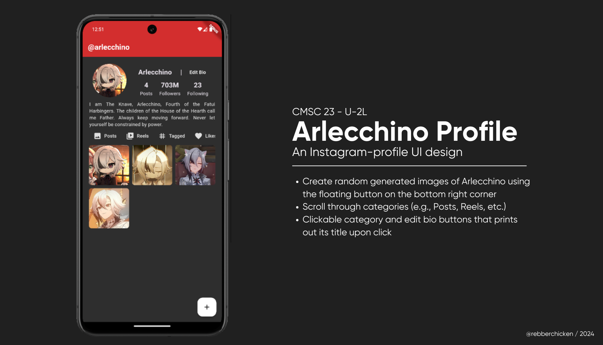
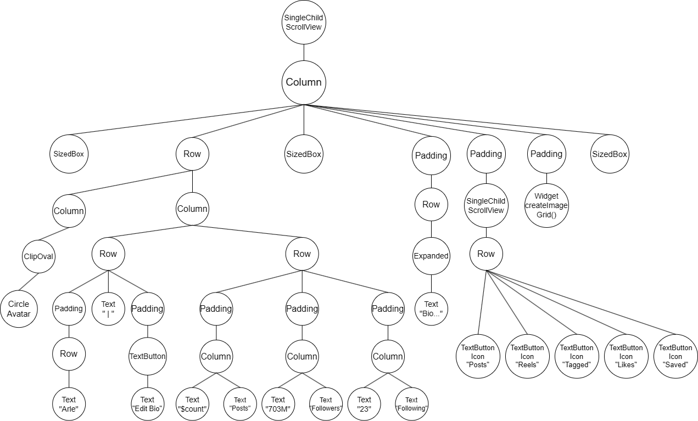

[](https://classroom.github.com/a/YqlM1o7p)

# Arlecchino Instagram Profile

## Code Description



This Flutter application displays an Instagram-like profile page of **Arlecchino**, a character from the popular video game, Genshin Impact. The top section includes a [1] **circular avatar** (GeeksforGeeks, 2020), [2] **edit bio button**, [3] **number of posts (dynamic)**, **followers (static)**, and **following (also static)**, and [4] a **horizontally scrollable category section** for text button icons of Posts, Reels, Tagged, Likes, and Saved. 

Below that is **a widget** of a vertically scrollable image grid (3 random pictures per row) with a floating action button that adds random images as posts. The program _initally has 4 posts_, and every time the button is pressed, it _adds a random Arlecchino picture/post_ to the end of the list.

## Features

1. **Dark Mode**: Experimented and applied a dark theme and customized its colors for a consistent look and feel.
2. **SingleChildScrollView**: Wrapped the main content in a `SingleChildScrollView` to make the entire screen scrollable.
3. **Stateful Widget**: The main screen is a `StatefulWidget` that manages the **row** containing the avatar, edit bio button, number of posts, followers, and following, the **sample bio**, and the **widget** with dynamic addition of images, similar to the sample code discussed.
4. **Floating Action Button**: Added a floating action button to add random images that has a `setState` of `Random()` and `random.nextInt(7)+1` to the grid.
5. **Used GridView.builder**: This grid layout displays 3 images per row.
6. **Padding & Layout**: Used `Padding` and `EdgeInsets` to layout the image grid horizontally.

### Body Layout


### How to Run Code
- Open Command Prompt or Windows Powershell.
- Navigate to the project directory.
- Run the following lines:
```sh
cd arlecchino
flutter emulator --launch "Pixel_API"
flutter run
```

### Sample Run


## References

- Colors class - Material Library - Dart API. (2024). Flutter.dev. https://api.flutter.dev/flutter/material/Colors-class.html
- GeeksforGeeks. (2020, August 25). ClipOval widget in Flutter. GeeksforGeeks. https://www.geeksforgeeks.org/clipoval-widget-in-flutter/
- Polański, T. (2018, May 3). Flutter Layout Cheat Sheet - Medium. https://medium.com/flutter-community/flutter-layout-cheat-sheet-5363348d037e
- Padding class - Widgets Library - Dart API. (2024). Flutter.dev. https://api.flutter.dev/flutter/widgets/Padding-class.html
- Khaddam, R. (2022, January 29). Flutter ScrollPhysics Variations & Use Cases - Medium. https://medium.com/@roaakdm/flutter-scrollphysics-variations-use-cases-da87528cc6c1
- SingleChildScrollView class - Widgets Library - Dart API. (2024). Flutter.dev. https://api.flutter.dev/flutter/widgets/SingleChildScrollView-class.html
- ThemeData class - Material Library - Dart API. (2024). Flutter.dev. https://api.flutter.dev/flutter/material/ThemeData-class.html
- Pinterest. (2023). Arlecchino Icons Board. https://ph.pinterest.com/kleponiez/arlecchino/
